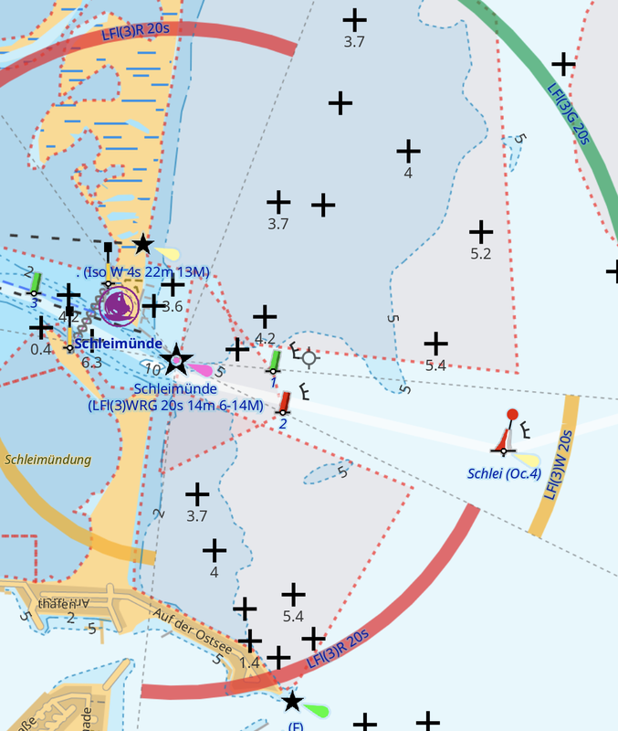

# Rendering of Sector Lights

Currently, it is [not possible to render light sectors](https://github.com/osmandapp/OsmAnd/issues/16894) directly in OsmAnd.

The workaround to get light sectors displayed is to create dedicated lines for the sector limits and sector arcs based on the [attributes of sector lights](https://wiki.openstreetmap.org/wiki/Seamarks/Lights#Sectored_light_attributes) in the OSM database. 

The procedure is as follows:

- download OSM data with [JOSM](https://josm.openstreetmap.de/) (use [overpass](https://overpass-turbo.eu/) to filter for lights only)
- save as OSM XML file
- run [lightsectors.py](lightsectors.py) on this file
- review the output file in JOSM (optional)
- generate an OBF with the [OsmAndMapCreator](https://osmand.net/docs/versions/map-creator) using these [rendering_types.xml](rendering_types.xml) from the output file

:exclamation: The sectors in this OBF are displayed in OsmAnd with the [marine style](marine.render.xml) only.

The script creates

- a colored arc for the sector with characteristics label
- lines at sector limits with bearing label
- a line for `light:orientation` with bearing and characteristics label
- a marker at the light source with characteristics label

:point_right: Example OBFs can be found in the [releases](https://github.com/quantenschaum/mapping/releases).

In OsmAnd light sectors look like this.



overpass query

```
[out:xml][timeout:90][bbox:{{bbox}}];
(
  nwr["seamark:light:colour"][~"seamark:type"~"landmark"];
  nwr["seamark:light:colour"][~"seamark:type"~"light"];
  nwr["seamark:light:colour"][~"seamark:type"~"beacon"];
  nwr["seamark:light:1:colour"][~"seamark:type"~"landmark"];
  nwr["seamark:light:1:colour"][~"seamark:type"~"light"];
  nwr["seamark:light:1:colour"][~"seamark:type"~"beacon"];
);
(._;>;);
out meta;
```
