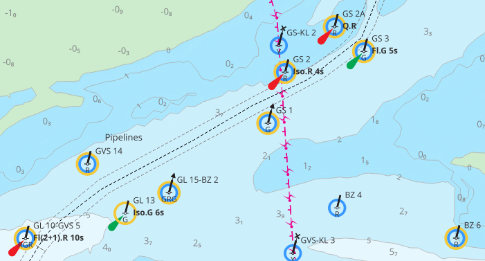
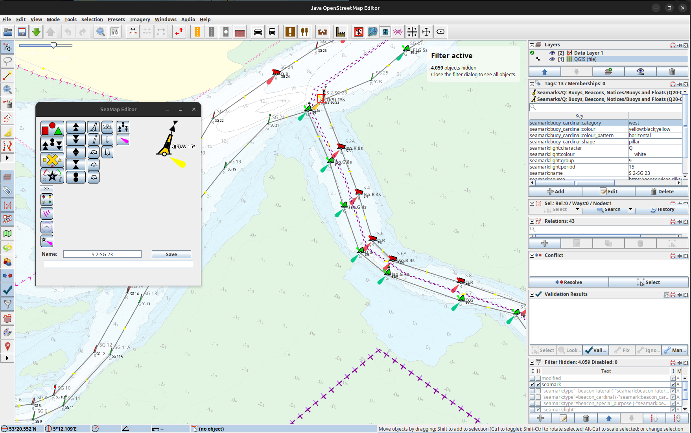
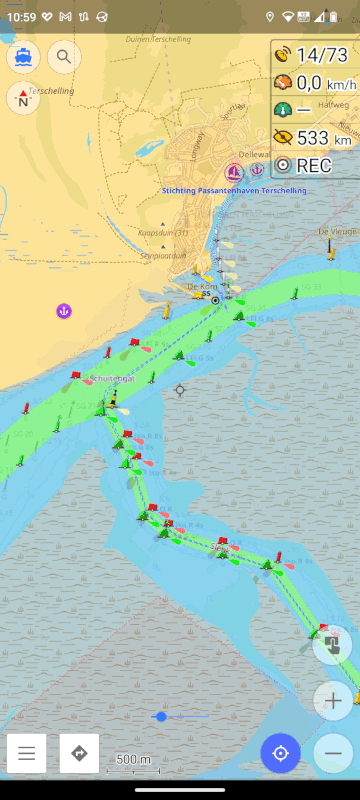

# S-57 ENC conversion

How to convert an electronic navigational chart to map tiles and how to use them to update [OSM](https://www.openstreetmap.org/) data.

This is based on a [description](https://www.sigterritoires.fr/index.php/affichage-des-cartes-marines-s57-dans-qgis/) I found on the net, but it did not work well and I did not like look, so I reworked it. The [S-57 ENC](http://www.s-57.com/) consisting of many files is transformed into shape files, one for each layer. Then these shape files are read by QGIS and rendered as specified in the [INT1](https://www.bsh.de/DE/PUBLIKATIONEN/_Anlagen/Downloads/Nautik_und_Schifffahrt/Sonstige-nautische-Publikationen/Wichtige-Zeichen-Abkuerzungen-Auswahl-Karte_1.html) (almost).

I will describe my procedure to update the buoys in the Waddenzee. The necessary commands are stored in the `makefile` and I use Linux.

1. download ENC from https://www.vaarweginformatie.nl/frp/main/#/page/infra_enc
2. extract the ZIP `make unzip`
3. convert the ENC to shape files with [`ogr2ogr`](https://gdal.org/programs/ogr2ogr.html) `make waddenzee` (It uses the mapping CSVs from OpenCPN.)
4. open them in [QGIS](https://www.qgis.org/) using `waddenzee.qgs` (You may want to add the `icons` path to QGIS: settings, options, system, SVG path)
5. export map tiles
   - processing, toolbox, raster tools, generate XYZ tiles (dir)
   - extent: draw on canvas and select the region you want to get rendered
   - max zoom: 16
   - set output dir and output html
   - run - this takes a while :coffee:

Then you can open the HTML file and view the tiles in your browser, it is a pretty up to date and accurate navigational chart.

This procedure should in principle work for other ENCs as well, you simply have to enable the buoys and beacons layer from the ENC.

The buoys and beacons in this map are pulled from the ArcGIS MapService listed at [data.overheid.nl](https://data.overheid.nl/dataset/2c5f6817-d902-4123-9b1d-103a0a484979) which is more up to date than the data in the ENC.

There are differences between the data in the ENC (yellow circles) and in the buoys and beacons dataset (blue circles).

There is a [public server with the tiles I have created](http://waddenzee.duckdns.org/). By enabling OpenStreetMap, Vaarweg Markeringen (RWS) and OpenSeaMap you can directly compare the positions of buoys and beacons in OSM and the dataset by RWS. 

## Updating OSM data with JOSM

I edit OSM data with [JOSM](https://josm.openstreetmap.de/). You can add the generated map tiles to JOSM as imagery layer.

- imagery, imagery preferences
- add TMS with URL `file:///path/to/qgis/tiles/{zoom}/{x}/{y}.png` or `http://waddenzee.duckdns.org/{zoom}/{x}/{y}.png`
- then activate the layer from imagery menu

You could use the WMS at `https://geo.rijkswaterstaat.nl/services/ogc/gdr/vaarweg_markeringen/ows` directly in JOSM, but then you do not get the metadata like name and light descriptor of the objects.

JOSM is pretty easy to use, how it works is explained in the [Wiki](https://josm.openstreetmap.de/wiki/Introduction). 

To get the seamarks displayed correctly in JOSM and make it easier to edit them you should add (under settings)

- Map Paint Style: `https://raw.githubusercontent.com/OpenSeaMap/josm/master/INT1_Seamark.mapcss`
- Plugin: SeaChart
- Plugin: SeaMapEditor
- Tagging Preset: `https://github.com/OpenSeaMap/josm/raw/master/INT-1-preset.xml`

For editing seamarks you may want to set a filter filtering on `seamark` and activate hide mode, such that only seamarks are displayed to make it less confusing.

Now you can update buoys and other seamarks by simply drawing them on top of the chart.

### scripted updates

Theoretically it is possible to update the positions and other metadata with a script that pulls the information from [the dataset](https://data.overheid.nl/dataset/2c5f6817-d902-4123-9b1d-103a0a484979) and inserts it into OSM. There are some problems though.

- How to match the information in the dataset to node in OSM correctly?
- How to handle additions and deletions correctly?
- When moving nodes, sometimes connected nodes need to moved along. How to handle this correctly?

I will look into the scripting functionality of JOSM, but before uploading data modified by a script it needs to checked and corrected manually.

## OpenCPN

The ENC files can also be viewed in [OpenCPN](https://opencpn.org/).

## OsmAnd

[OsmAnd](https://osmand.net/) is a very good map and navigation app for all kinds activities. It features a boating profile where seamarks are displayed and it possible to include map tiles from other sources like sat imagery or custom made tiles. It is pretty complex, you should [read the manual](https://osmand.net/docs/intro).

Enable the boating profile in the settings and also enable the [nautical charts](https://osmand.net/docs/user/plugins/nautical-charts) and [online maps](https://osmand.net/docs/user/plugins/online-map) extensions. When you switch to the boating profile the land areas are shown in sand colour and seamarks like buoys are displayed. You can customize the map by tapping the boat icon in the top left corner. 

You have to [download map data](https://osmand.net/docs/user/start-with/download-maps) for the regions you are interested it. These maps already contain the seamarks, but they are only displayed in the nav chart map style (boating profile). You may download worldwide seamarks, too, which contains seamarks only but worldwide, so the map shows seamarks also for region where did not download the (detailed) map data for.

The map data is based on OSM and gets updated monthly, so the changes you make to OSM data using JOSM will not show up immediately. You may enable [live updates](https://osmand.net/docs/user/personal/maps#osmand-live) to get the updates more quickly, but some features may show up multiple times (from map data, worldwide seamarks and the update). 

OSM contains two render engines, version 2 is OpenGL based, it's faster and and not bound to fixed zoom levels, but it only shows all buoys if zoomed in very closely and they are [off position](https://github.com/osmandapp/OsmAnd/issues/17413) as well. I do prefer the old version 1 render engine.

### Raster Maps

To add a [custom raster map](https://osmand.net/docs/user/map/raster-maps), tap top left, map source, add manually, then

- name: name of this map
- URL: `http://waddenzee.duckdns.org/{0}/{1}/{2}.png` (or just click [here](http://osmand.net/add-tile-source?name=QGIS&min_zoom=10&max_zoom=16&url_template=http://waddenzee.duckdns.org/{0}/{1}/{2}.png))
- format: SQlite

So you can use any TMS maps you find on the net or upload the tiles you have generated with QGIS to a webserver.

You can use his raster layer as an overlay with transparency slider displayed at the bottom of the map, so you can seamlessly switch between two maps.

The raster map tiles can be predownloaded into the cache, so they are available for offline usage. Select the raster map as main map or overlay, then long press somewhere, actions, download map, zoom to the area you want to download, select the map source and zoom levels and start the download.