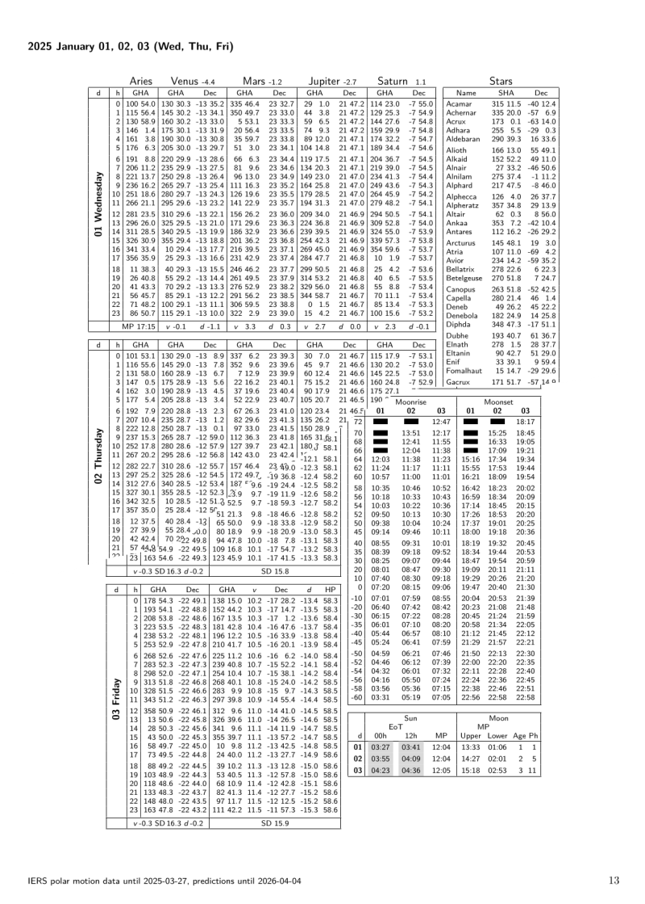

# Nautical Almanac

For those interested in celestial navigation I created a [Nautical Alamanac in its own project](https://github.com/quantenschaum/nautical_almanac).

The current almanac can be downloaded here.

- [Nautical Alamanac 2025 PDF](Nautical-Almanac-2025.pdf){:download}
- [Daily Pages 2025 TXT](daily-pages-2025.txt){:download}

