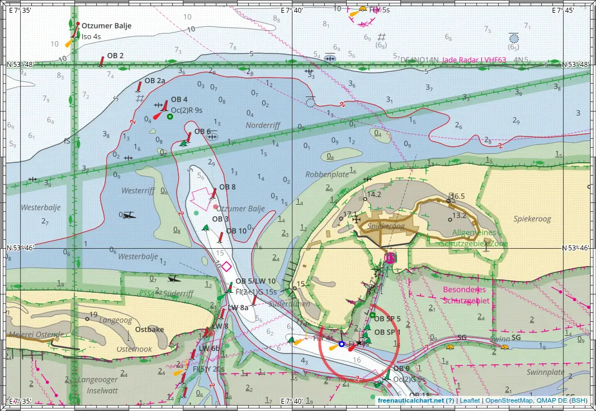

# Printing Charts

There are multiple ways to print a chart. You can print the raster data directly from your browser (quick and easy) or print vector data from QGIS (better quality but more complicated).

## Print from Browser

1. Open the chart in the browser (works best in Chrome based browsers).
2. Click on the print layout button somewhere at the top left and select the desired target paper format and orientation.
3. Adjust zoom and position of the chart to your liking. 
4. Now print the chart (ctrl+p). In the print dialogue 
     - select the right paper size and orientation
     - set margins to none or zero or minimal
     - the chart should be centered on a single page
5. Print!

!!! tip "zoom level and symbol size"
    With an active print layout you may zoom out half a zoom step to fit some more content of the map and make the text and symbols appear smaller without actually switching to another zoom level.
    
!!! tip "print to PDF"
    You may print to PDF instead of printing directly on paper. This way you can save chart for printing it again later. It also allows you to print the chart to an A3 PDF, which can be printed downscaled onto A4. This makes a higher resolution print, but with smaller text and symbols.

### Image export

With the lower of the two buttons in the print widget on the top left you can export the currently shown map as an image file. You can resize the browser window to the desired size before the export, or you can select a print layout.

This is useful for creating screenshots of the map without the control elements but including the lat/lon borders.

 
## Print from QGIS

You can use QGIS to create a chart [like this one](print/Juist.pdf).

You can print your own custom charts with the classical lat/lon zebra border as follows.

1. Install [QGIS](https://qgis.org/) on your computer.
2. Download the [data package](qmap-data.zip){:download} containing all necessary file.
3. Unzip the data package.
4. Open `bsh.qgs` with QGIS.
5. Select `Project > Layout Manager`.
6. Doubleclick the `paperchart` layout and the layout editor will open.
   
7. Adjust the layout to your liking, select the part of the map you want to print (use the move content tool (C)).
8. Export as PDF.
9. Print the PDF (direct printing from QGIS may work, but PDF is usually more reliable and you can save it to print it again).
