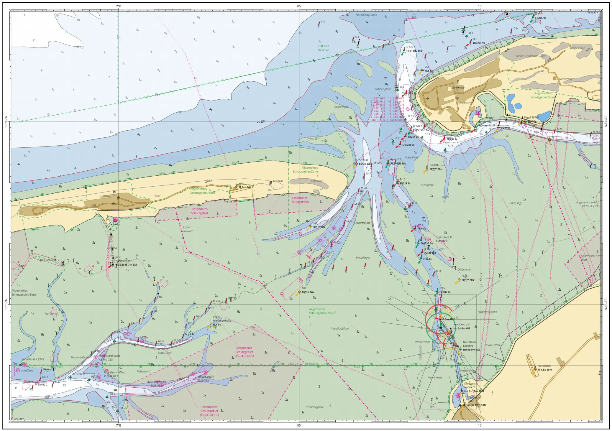
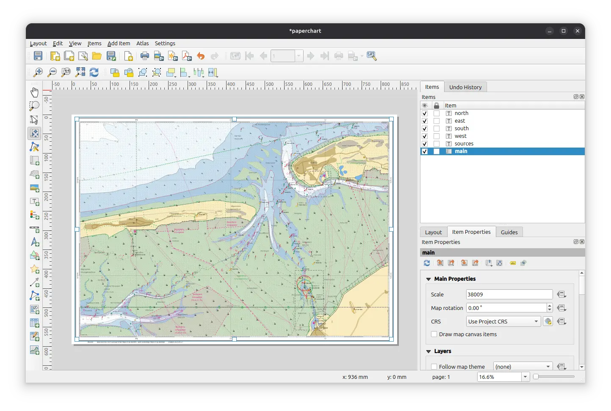

# Printing Charts

How to print your own charts [like this one](print/Juist.pdf).

You can print your own custom charts with the classical lat/lon zebra border as follows.

1. Install [QGIS](https://qgis.org/) on your computer.
2. Download the [data package](qmap-data.zip){:download} containing all necessary file.
3. Unzip the data package.
4. Open `bsh.qgs` with QGIS.
5. Select `Project > Layout Manager`.
6. Doubleclick the `paperchart` layout and the layout editor will open.
   
7. Adjust the layout to your liking, select the part of the map you want to print (use the move content tool (C)).
8. Export as PDF.
9. Print the PDF (direct printing from QGIS may work, but PDF is usually more reliable and you can save it to print it again).
