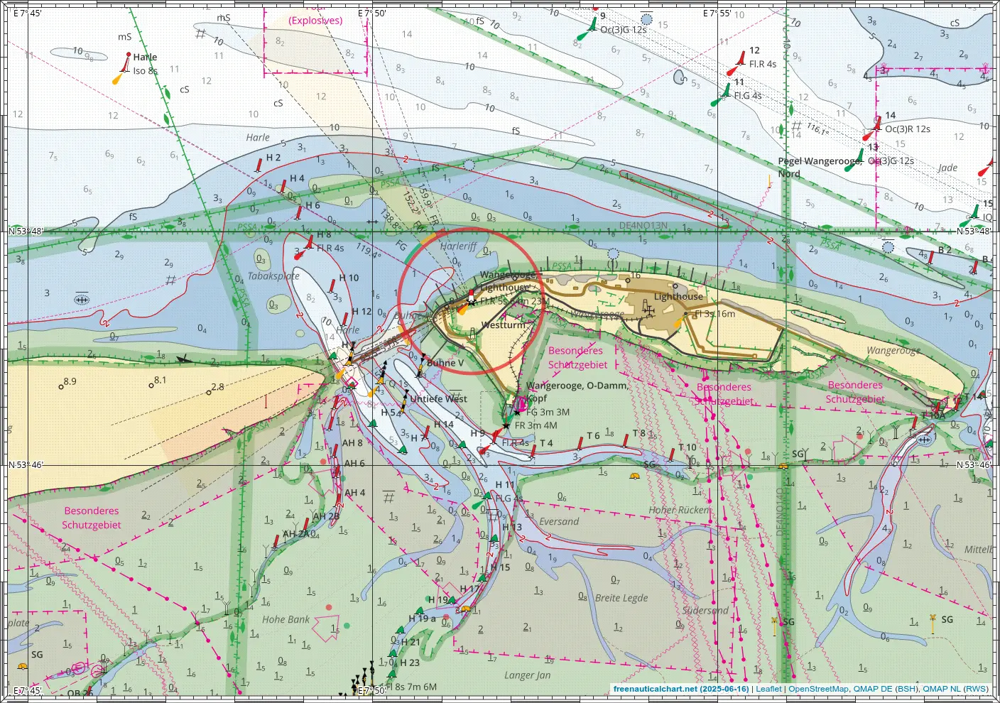

# Kaarten afdrukken

Er zijn meerdere manieren om een kaart af te drukken. Je kunt de rastergegevens direct vanuit je browser afdrukken (snel en eenvoudig) of vectorgegevens vanuit QGIS afdrukken (betere kwaliteit maar ingewikkelder).

## Afdrukken vanuit browser

1. Open de kaart in de browser (werkt het beste in browsers op basis van Chrome).
2. Klik op de printlayoutknop ergens linksboven en selecteer het gewenste papierformaat en de gewenste afdrukstand.
3. Pas de zoom en positie van de kaart naar wens aan.
4. Druk nu de kaart af (ctrl+p). In de afdrukdialoog
     - selecteer het juiste papierformaat en de juiste afdrukstand
     - stel marges in op geen, nul of minimaal
     - de grafiek moet gecentreerd zijn op een enkele pagina
5. Afdrukken!

!!! tip "zoomniveau en symboolgrootte"
    Met een actieve afdruklayout kun je een halve zoomstap uitzoomen om wat meer inhoud van de kaart te passen en de tekst en symbolen kleiner te laten lijken zonder daadwerkelijk naar een ander zoomniveau over te schakelen.
    
!!! hint "afdrukken naar PDF"
    Je kunt afdrukken naar PDF in plaats van direct op papier. Zo kun je de kaart opslaan en later opnieuw afdrukken. Je kunt de kaart ook afdrukken naar een A3 PDF, die kan worden verkleind naar A4. Dit zorgt voor een afdruk met een hogere resolutie, maar met kleinere tekst en symbolen.

    Het afdrukken van PDF's is over het algemeen betrouwbaarder dan het rechtstreeks afdrukken vanuit apps. Vaak is er betere controle over de printer en zijn er meer opties beschikbaar. Dus, als rechtstreeks afdrukken vanuit de browser mislukt, probeer dan af te drukken naar PDF en druk vervolgens de PDF af vanuit je PDF-viewer.

!!! hint "Papier en Inkt"
    Het wordt sterk aangeraden om een laserprinter te gebruiken, omdat toner watervast is. Inkt van inkjetprinters is doorgaans niet watervast en kan bij contact met water uitlopen, waardoor de afdruk onbruikbaar wordt. Er bestaat ook watervast papier van behandeld katoen of kunststof dat geschikt is voor laserprinters; daarmee krijgt u een waterbestendige afdruk.

### Afbeelding exporteren

Met de pijlknop in de printwidget linksboven kun je de momenteel getoonde kaart exporteren als een afbeeldingsbestand. Je kunt de grootte van het browservenster aanpassen aan de gewenste grootte voordat je gaat exporteren, of je kunt een printlayout selecteren.

Dit is handig voor het maken van schermafbeeldingen van de kaart zonder de bedieningselementen, maar met de lat/lon randen.

## Afdrukken vanuit QGIS

Je kunt QGIS gebruiken om een kaart te maken [zoals deze](img/paperchart.pdf).

Je kunt als volgt je eigen aangepaste kaarten afdrukken met de klassieke lat/lon zebrarand.

1. Installeer [QGIS](https://qgis.org/) op uw computer.
2. Download het [datapakket](qmap-data.zip){:download} dat alle benodigde bestanden bevat.
3. Pak het gegevenspakket uit.
4. Open `rws.qgs` met QGIS.
5. Selecteer `Project > Layout Manager`.
6. Dubbelklik op de `paperchart` layout en de layout editor wordt geopend.
7. Pas de lay-out naar wens aan, selecteer het deel van de kaart dat je wilt afdrukken (gebruik het verplaatsgereedschap (C)).
8. Exporteer als PDF.
9. Druk de PDF af (rechtstreeks afdrukken vanuit QGIS kan werken, maar PDF afdrukken is meestal betrouwbaarder en je kunt het opslaan om het opnieuw af te drukken).

## Grote formaten

Het is mogelijk kaarten af te drukken op formaten groter dan A4. Omdat men meestal slechts een A4-printer heeft, print men de kaart verspreid over meerdere A4-bladen en plakt men deze daarna samen tot een kaart van de gewenste grootte. Ga als volgt te werk.

1. Maak van de te printen kaart een PDF met één pagina in het gewenste formaat. Let daarbij op de resolutie en de grootte van letters en symbolen in het eindformaat. Gebruik voor de beste kwaliteit QGIS of kies een overeenkomstig groot formaat (dat mogelijk niet volledig op het scherm zichtbaar is; met Ctrl-Minus kun je uitzoomen, Ctrl-0 zet terug naar 100%) en exporteer naar PDF. Stel de marges en het papierformaat dienovereenkomstig in.
2. Verdeel deze PDF over meerdere A4-bladen. Sommige PDF-viewers kunnen dit al doen; anders kun je [dit script](https://github.com/quantenschaum/mapping/blob/master/scripts/poster.py) gebruiken (vereist Linux, Python, pdfposter, LaTeX). Met de optie `-p` kun je het gewenste aantal pagina's opgeven, bijv. `-p 4x2` verdeelt de kaart over 4x2=8 bladen, wat ongeveer overeenkomt met A1 (iets kleiner door overlappende lijmvoegen).
3. Print de pagina's uit en zet de automatische schaling van de printer uit.
4. Snijd telkens de onder- en rechterrand weg; gebruik daarvoor de snijtekens.
5. Plak de vellen aan elkaar tot één grote kaart.

!!! example "Voorbeeldkaart"
    Het volgende voorbeeld toont de Elbemonding, eenmaal vanuit de browser als A1-PDF gemaakt en verdeeld over 4x2 A4-bladen en eenmaal uit QGIS gegenereerd.

    - Browser (rastergrafiek)
        - [Voorbeeldkaart A1, één pagina](img/FreeNauticalChart.pdf)
        - [Voorbeeldkaart A1, 4x2 A4](img/FreeNauticalChart.4x2.pdf)
    - QGIS (vectorgrafiek, hoge kwaliteit)
        - [Voorbeeldkaart A1, één pagina](img/paperchart.A1.pdf)
        - [Voorbeeldkaart A1, 4x2 A4](img/paperchart.4x2.pdf)
