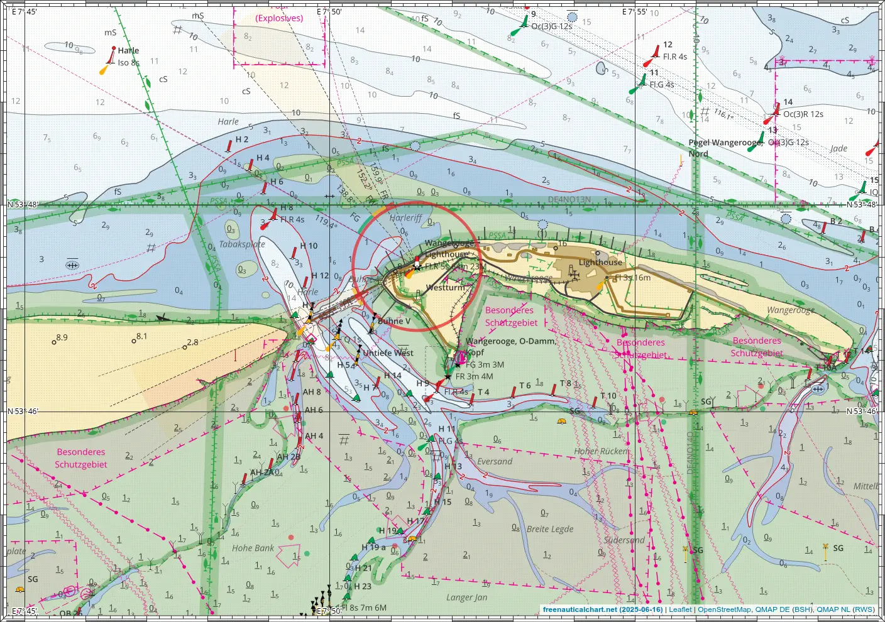
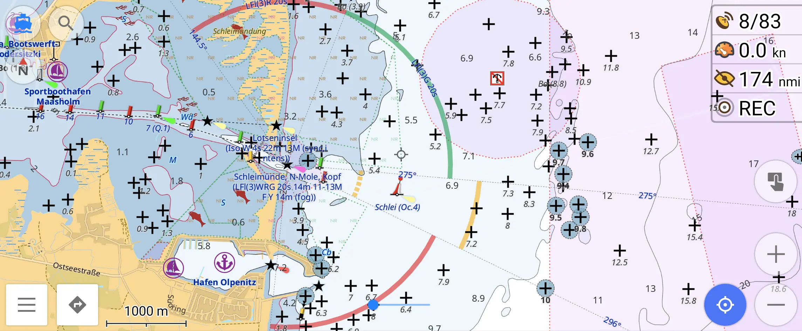
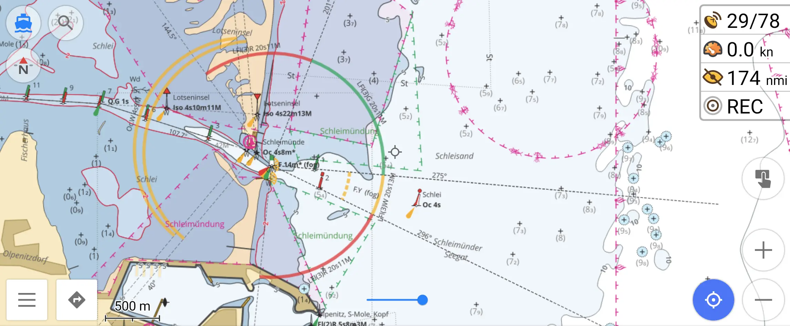
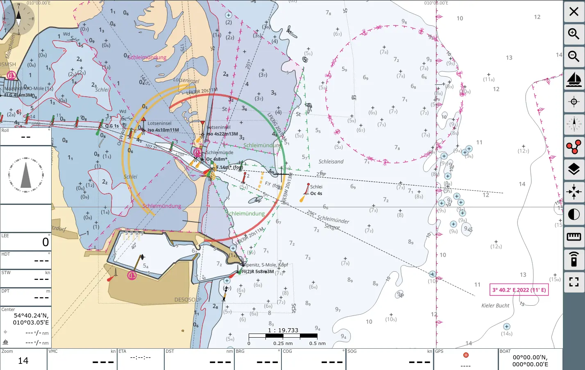
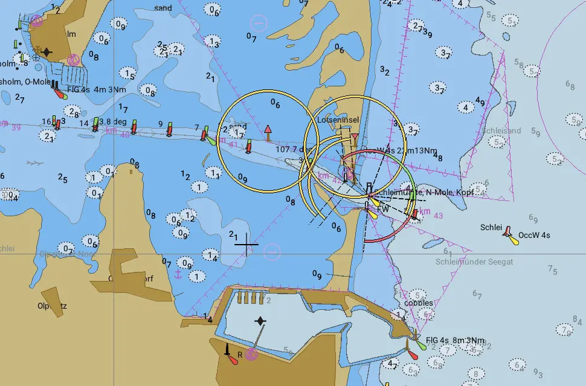
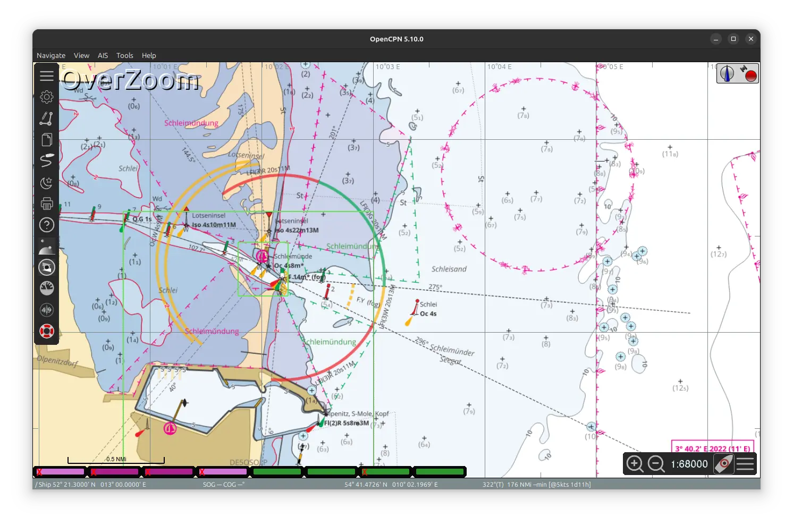
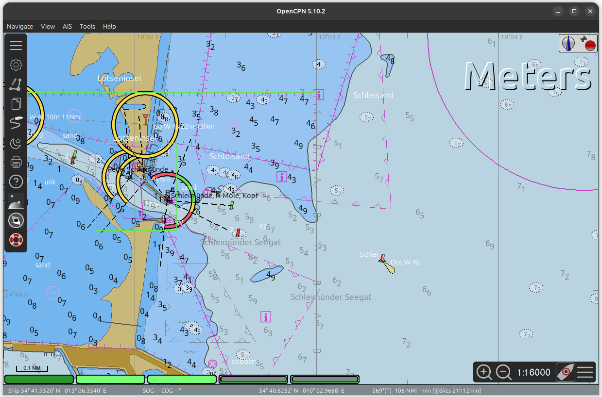
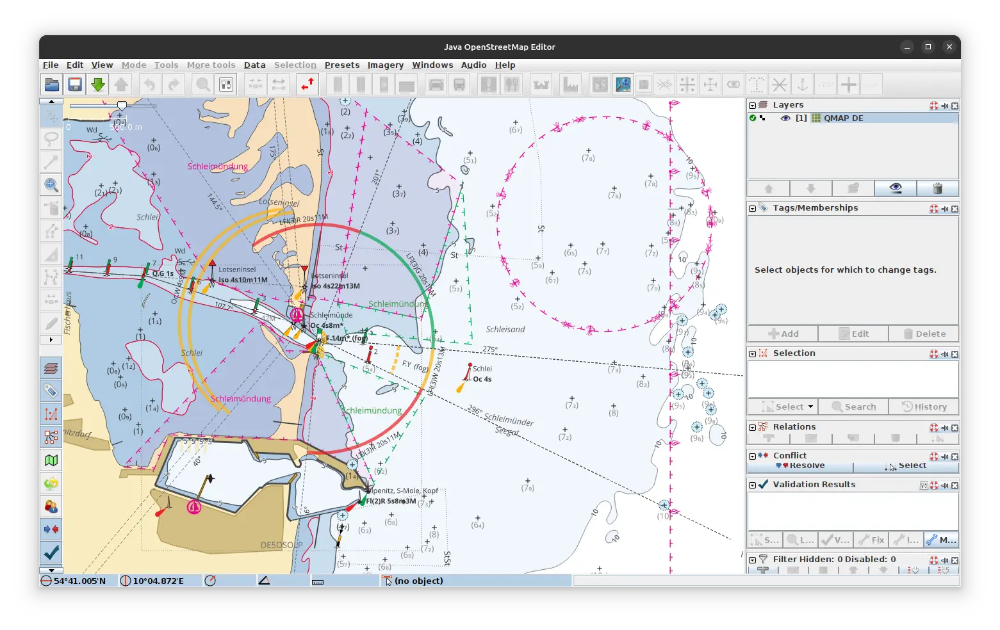
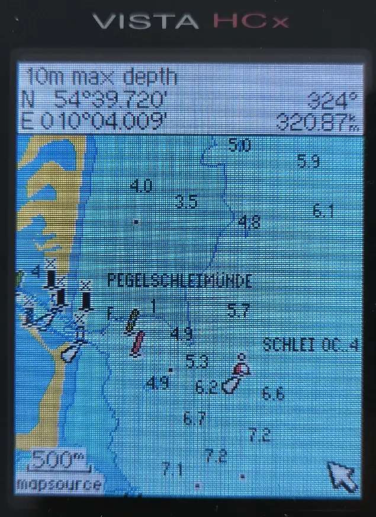

# Bildschirmfotos

Wie sehen die Karten in verschiedenen Anwendungen aus?

## Browser

Aus dem Browser exportiertes Bild

## OsmAnd

Vektor-Karte

Raster-Overlay

## AvNav

Raster-Karte

Vektor-Karte via Ocharts(NG)

## OpenCPN

Raster-Karte

Vektor-Karte

## JOSM

Hintergrund-Layer

## Garmin

Kleines Hand-Gerät eTrex Vista HCx

