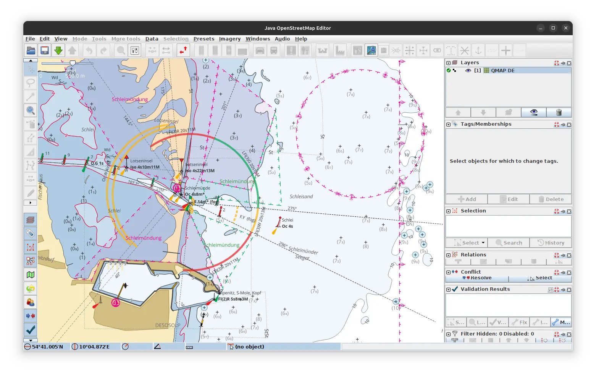

# Screenshots

How do these charts look like in various applications?

## OsmAnd

Vector Chart

Raster Overlay

## AvNav

Raster Chart

Vector Charts via Ocharts(NG)

## OpenCPN

Vectop Chart

## JOSM

Imagery Layer

## Garmin

Small handheld device eTrex Vista HCx

