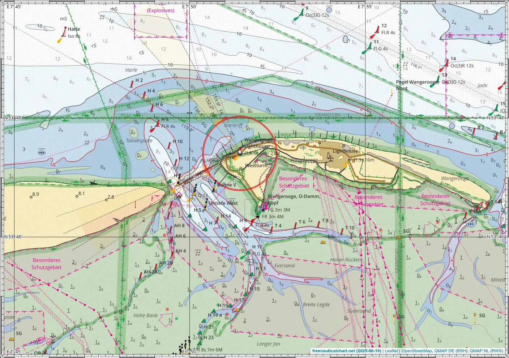
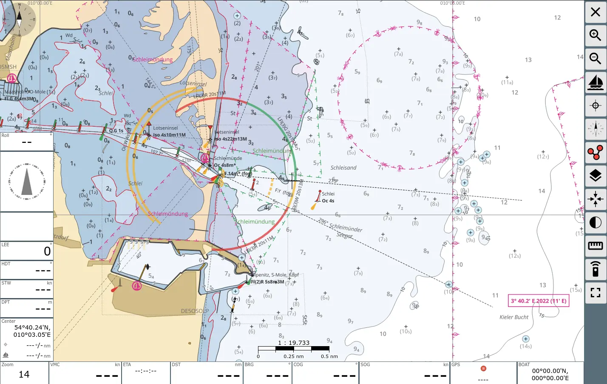
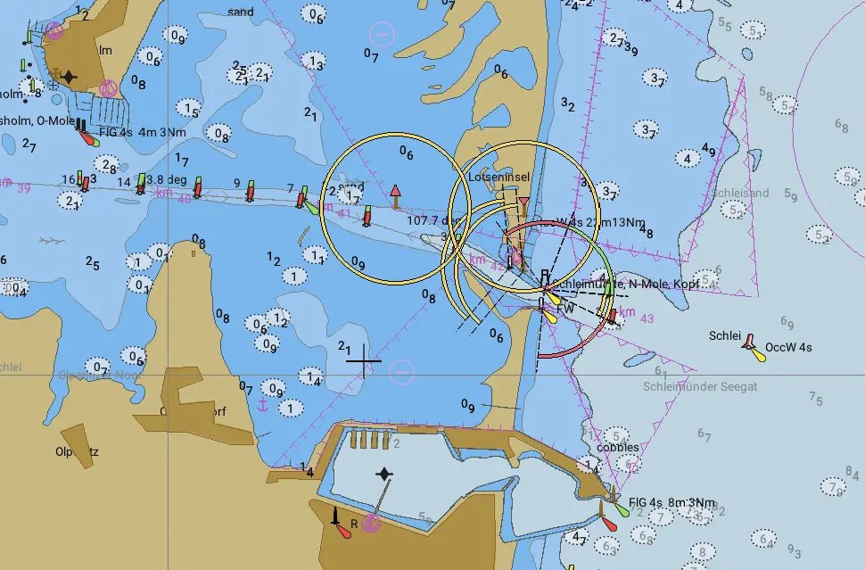
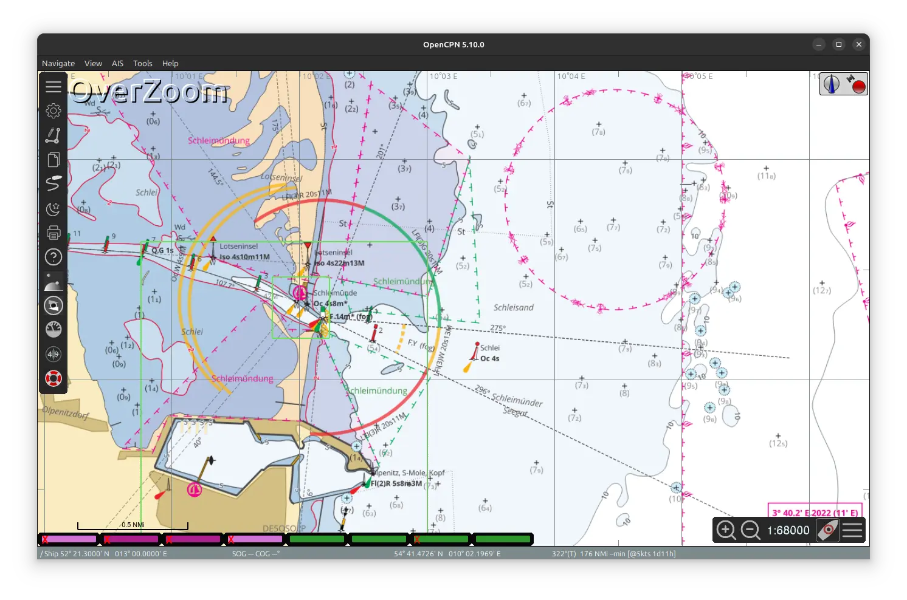

# Screenshots

How do these charts look like in various applications?

## Browser

Image exported from the browser

## OsmAnd

Vector Chart

Raster Overlay

## AvNav

Raster Chart

Vector Charts via Ocharts(NG)

## OpenCPN

Raster Chart

Vector Chart

## JOSM

Imagery Layer

## Garmin

Small handheld device eTrex Vista HCx

