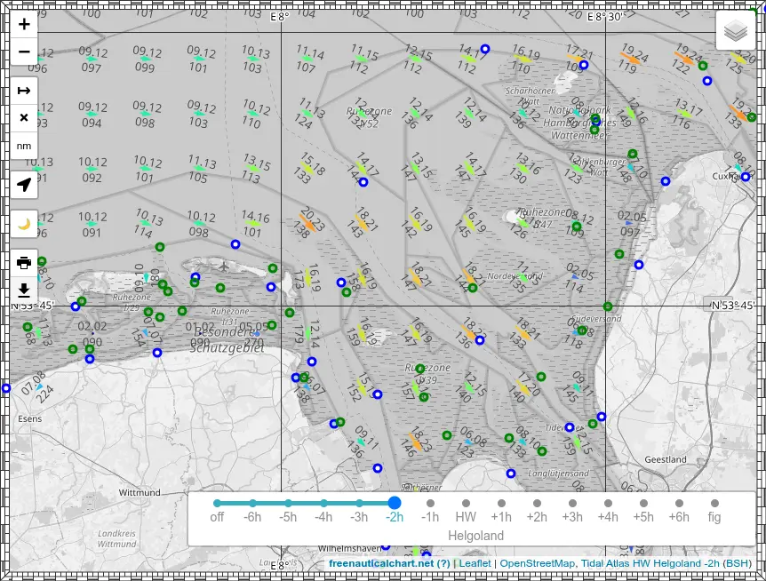
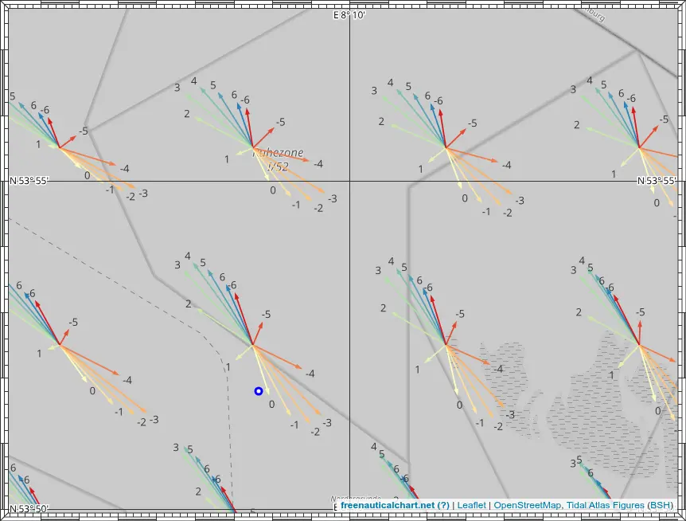

# Gezeitenstromatlas

## Gezeitenstrom

Das BSH stellt Gezeitenstromdaten für die Nordsee, den Ärmelkanal und die Deutsche Bucht (höhere Auflösung) bereit.

Die Darstellung dieser Daten im [GeoSeaPortal](https://www.geoseaportal.de/mapapps/resources/apps/gezeitenstromatlas) ist leider nicht wirklich brauchbar, man kann weder den Datensatz noch die Gezeitenstunde auswählen. Aber die Rohdaten sind unter [Nordsee](https://gdi.bsh.de/de/feed/Tidal-currents-North-Sea.xml)/[Küste](https://gdi.bsh.de/de/feed/Tidal-currents-German-coastal-waters-and-neighbouring-regions.xml) verfügbar.

Ich habe QGIS verwendet, um die durchschnittliche Gezeitenströmung darzustellen, und Beschriftungen für Stromgeschwindigkeit und -richtung hinzugefügt, so dass man die Stunde der Gezeiten auswählen kann und je nach Zoomstufe einen Überblick über die Gezeitenströmung erhält. Stromgeschwindigkeit und -richtung können an der gewünschten Position (bei entsprechender Zoomstufe) direkt ablesen werden.

Die Karte sieht wie oben abgebildet aus. Mit dem Schieberegler wird die Stunde vor/nach Hochwasser Helgoland ausgewählt. Die Pfeile in Größe und Farbe zeigen die durchschnittliche Stromgeschwindigkeit und -richtung an. Die Zahl unter dem Pfeil ist die durchschnittliche Stromrichtung, die Zahlen über dem Pfeil sind die Stromgeschwindigkeit in Zehntelknoten bei Nipptide (vor dem Punkt) und bei Springtide (nach dem Punkt).

Wenn der Schieberegler auf `fig` eingestellt ist, werden die Gezeitenpfeile aller Stunden gleichzeitig angezeigt, um die Gezeitenstromfigur für den jeweiligen Ort darzustellen. Die Zahlen stehen für die Stunde vor/nach HW.

## Gezeitentafeln und Wasserstand

Das deutsche BSH und der niederländische RWS stellen Gezeitendaten betreit unter

- <https://gezeiten.bsh.de/>
- <https://wasserstand-nordsee.bsh.de/>
- <https://waterinfo.rws.nl/>

Diese sind in die Karte integriert worden. Durch Anklicken der blauen Markierungen erhalten Sie in einem Popup die Gezeitenvorhersagedaten für den aktuellen und den nächsten Tag. Wenn nicht anders angegeben, ist die Bezugshöhe SKN/LAT.

