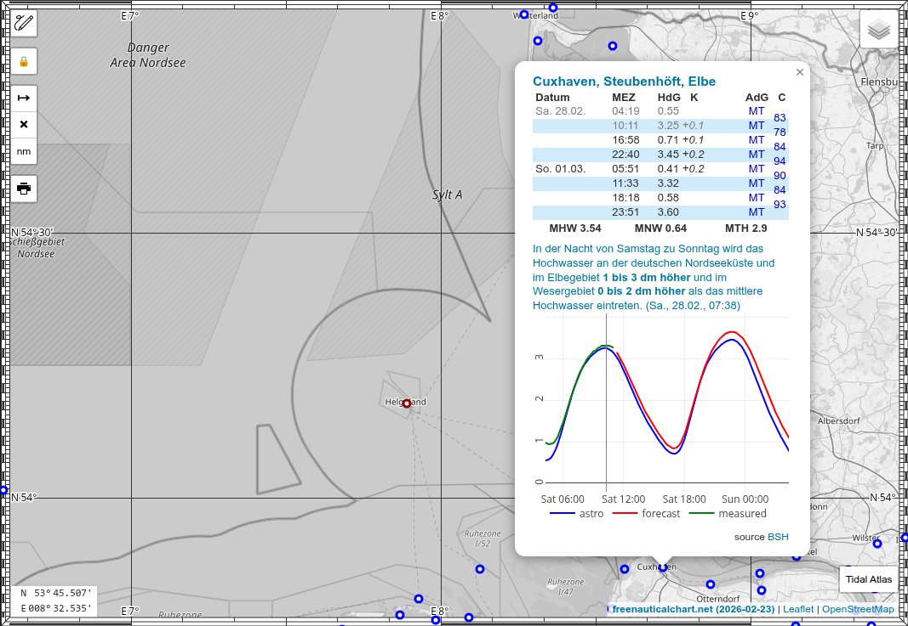
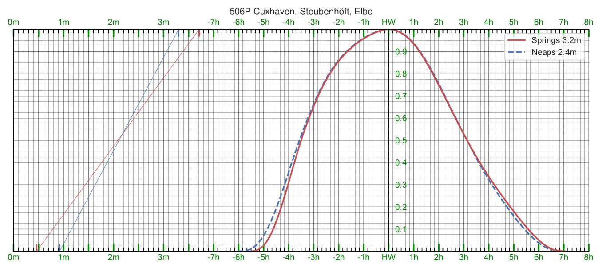
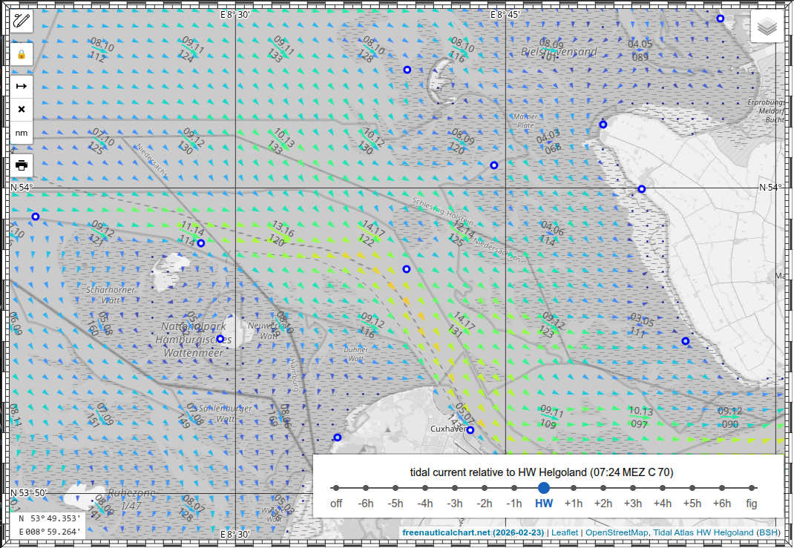
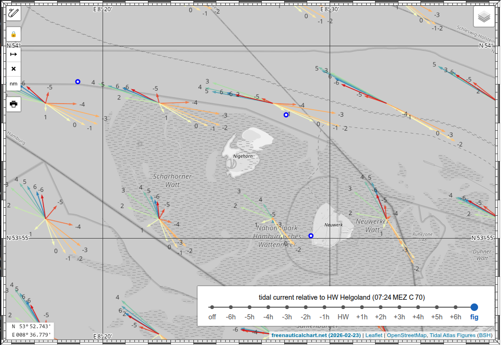

# Tides

## Times and Water level

The German BSH and the Dutch RWS provide tide data at

- <https://gezeiten.bsh.de/>
- <https://wasserstand-nordsee.bsh.de/>
- <https://waterinfo.rws.nl/>

These have been integrated into the map. By clicking on the blue markers, you get tide forcast data for the current and the next day in a popup. The reference height level is LAT if not otherwise indicated.



### Height of Tide

The Height of the tide (HdG) value is the height relative to LAT calculated with the [astronomical forecast](https://gezeiten.bsh.de) model. The value K thereafter is a correction to be applied to the HdG, which contains the effects of the weather. This is also calculated by the BSH and published in their [waterlevel forecast](https://wasserstand-nordsee.bsh.de). 

!!! warning
    The BSH references their waterlevel correction to mean high/low water, whereas K is relative to the astronomical forecast value, it includes weather effects only.

### Tidal Coefficient

Similar (but different) to the french tidal coefficient I introduced the tidal coefficient C. It is defined as the ratio of the current rise/fall of the tide to the mean springs range.

```
             | HW -LW |
C = 100 * ------------------
          mean springs range
```

Why is this usefull? - It tells you directly how the ongoing rise/fall of the tide compares to the mean springs range. And since the current velocity (drift) is mostly directly proportional to the rise/fall range, C can be used to scale the springs velocity given in the tidal current atlas. This makes current interpolation much easier and faster.

It is calculated add displayed between two rows.

!!! example
    If you want to know the drift at 28.02. 1200, you read C as 78. So, you just multiply the springs drift you read off the tidal atlas by 0.78 and get the interpolated value.
    
### Tide Curves



Tide curves in the ATT style calculated from the data provided by the BSH, can be downloaded [here](index.md#tide-curves).

## Tidal Current

The BSH provides tidal current data for the North Sea, the Channel and the Germany Bight (higher resolution).
The presentation of this data in the [GeoSeaPortal](https://www.geoseaportal.de/mapapps/resources/apps/gezeitenstromatlas) is not very usable, you can neither select the dataset nor the hour of the tide. But the raw data is available at [North Sea](https://gdi.bsh.de/de/feed/Tidal-currents-North-Sea.xml)/[Coastal](https://gdi.bsh.de/de/feed/Tidal-currents-German-coastal-waters-and-neighbouring-regions.xml).

I used [QGIS](https://qgis.org/) to render the average tidal current field and added annotations for set and drift, so you can choose the hour of the tide, depending on the zoom level you get an overview of the tidal current, and you can directly read off set and drift at the desired position (when zoomed in). If you zoom in further, the coastal dataset with finer resolution is displayed.



The chart looks as shown above. The slider is used to select the hour before/after high water at Helgoland. The arrows in size and color show average set and drift, The number below the arrow is the average set (direction), the numbers above the arrow are the drift (velocity) in 10th of a knot at neaps (before the dot) and at springs (after the dot).



When the slider is set to `fig`, all tide arrows are shown simultaneously revealing the tide figure for the location. The numbers are the hour before/after HW.
