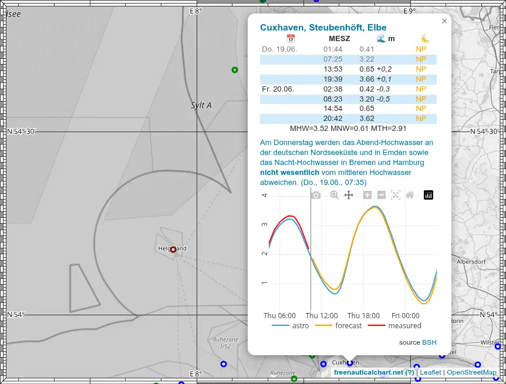

# Tidal Atlas

## Tidal Current

The BSH provides tidal current data for the North Sea, the Channel and the Germany Bight (higher resolution).
The presentation of this data in the [GeoSeaPortal](https://www.geoseaportal.de/mapapps/resources/apps/gezeitenstromatlas) is not very usable, you can neither select the dataset nor the hour of the tide. But the raw data is available at [North Sea](https://gdi.bsh.de/de/feed/Tidal-currents-North-Sea.xml)/[Coastal](https://gdi.bsh.de/de/feed/Tidal-currents-German-coastal-waters-and-neighbouring-regions.xml).

I used QGIS to render the average tidal current field and added annotations for set and drift, so you can choose the hour of the tide, depending on the zoom level you get an overview of the tidal current, and you can directly read off set and drift at the desired position (when zoomed in).

The chart looks as shown above. The slider is used to select the hour before/after high water at Helgoland. The arrows in size and color show average set and drift, The number below the arrow is the average set (direction), the numbers above the arrow are the drift (velocity) in 10th of a knot at neaps (before the dot) and at springs (after the dot).

When the slider is set to `fig`, all tide arrows are shown simultaneously revealing the tide figure for the location. The numbers are the hour before/after HW.

## Times and Water level

The German BSH and the Dutch RWS provide tide data at

- <https://gezeiten.bsh.de/>
- <https://wasserstand-nordsee.bsh.de/>
- <https://waterinfo.rws.nl/>

These have been integrated into the map. By clicking on the blue markers, you get tide forcast data for the current and the next day in a popup. The reference height level is LAT if not otherwise indicated.

