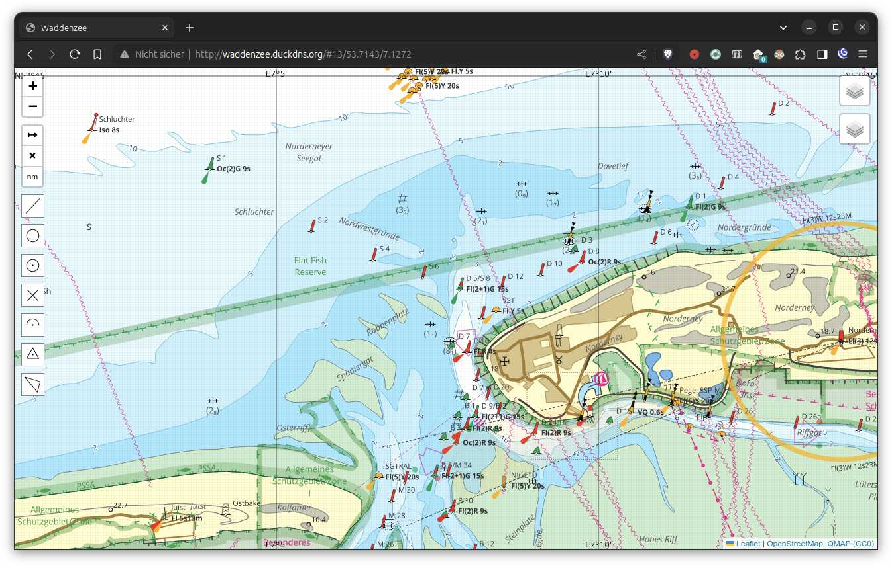

# Usage

To use the maps generated by this project you do not need to know the [details of the entire process](creation.md). This brief guide tells you how to simply use the use maps and other resources I provide.

## Web Service

:material-web: <http://waddenzee.duckdns.org/>

On this website you can view the available maps in your browser. You can switch layers in the top right corner and use the simple measurement and plotting tools on the left. The map looks like in the example above.

Additionally, you can switch to other base layers and overlays from other sources.

- ENC - [ENC by RWS](https://www.vaarweginformatie.nl/frp/main/#/page/infra_enc) with Buoys and Beacons from the ENC
- Vaarweg Markeringen - buoys and beacons directly from the [server by RWS](https://geo.rijkswaterstaat.nl/services/ogc/gdr/web/) (more up to date than the ENC)
- BSH ... - selected layer from [GeoSeaPortal](https://www.geoseaportal.de/mapapps/resources/apps/navigation) by [BSH](https://www.bsh.de/DE/THEMEN/Geoinformationen/geoinformationen_node.html)
- [OpenSeaMap](https://map.openseamap.org/)

## OpenSeaMap

:material-web: <https://map.openseamap.org/>

The positions and metadata of buoys and other objects are worked into the OSM database and thus are available in the OpenSeaMap project and other software that uses this data.

## OsmAnd

:material-web: <https://osmand.net/>

:fontawesome-brands-youtube: There is a [YouTube OsmAnd Playlist](https://www.youtube.com/playlist?list=PLVV1f2QQn7GxWiF0C0-e9oJkfkdYLZGms) with demonstrations of how to use OsmAnd.

[OsmAnd](https://osmand.net/) is a very good map and navigation app for all kinds of activities. It features a boating profile where seamarks are displayed, and it is possible to include map tiles from other sources like sat imagery or custom tiles. It is pretty complex, you should [read the manual](https://osmand.net/docs/intro).

!!! hint
    Consider paying for OsmAnd to support their amazing work!

You have to [download map data](https://osmand.net/docs/user/start-with/download-maps) for the regions you are interested it. These maps
_already contain the
seamarks_, but they are only displayed in the nav chart map style (boating profile). You may optionally download worldwide seamarks, too, which contains seamarks only, but worldwide, so the map shows seamarks also for regions where did not download the (detailed) map data for.

Enable the boating [profile](https://osmand.net/docs/user/personal/profiles/) in the settings and also enable the [nautical charts](https://osmand.net/docs/user/plugins/nautical-charts) and [online maps](https://osmand.net/docs/user/plugins/online-map) extensions. When you switch to the boating profile the land areas are shown in sand colour and seamarks like buoys are displayed. You can [customize the map](https://osmand.net/docs/user/map/configure-map-menu) by tapping the boat icon in the top left corner.

The map data provided by OsmAnd is based on OSM and gets updated _monthly_, so the changes made to OSM data will not show up immediately. You may enable [live updates](https://osmand.net/docs/user/personal/maps#osmand-live) to get the updates more quickly, but some features may show up multiple times (from map data, worldwide seamarks and the update).

OSM contains two render engines, version 2 is OpenGL based, it's faster and not bound to fixed zoom levels. It is the current default, use engine 2.

### Vector Charts

The look of and the data available in the OsmAnd nautical chart can be extended further. You need to [download](index.md#vector-charts) the extra files for OsmAnd. Additionally, to buoys and beacon from OSM you also get

- depth contours and spot soundings (in NL)
- light sector limits and arcs with proper light descriptor strings

Install these files and switch to the _marine_ rendering style and enable _nautical depth_. Now your chart should look like this.

To make full use of the data in these files in form of a [nautical chart](https://osmand.net/docs/user/plugins/nautical-charts/), you have to

- use [render engine 2 (OpenGL)](https://osmand.net/docs/user/personal/global-settings#map-rendering-engine),
- enable the [nautical charts plugin](https://osmand.net/docs/user/plugins/nautical-charts),
- use the [boating profile](https://osmand.net/docs/user/personal/profiles/),
- enable the display of [nautical depth](https://osmand.net/docs/user/plugins/nautical-charts#depth-contours),
- **install and activate** the `marine` [rendering style](https://osmand.net/docs/user/map/vector-maps).

!!! attention
    The vector chart will not be rendered properly without the marine rendering style and render engine 2 (OpenGL)!

### Raster Charts

Another way to use these charts in OsmAnd is to use the [raster chart](https://osmand.net/docs/user/map/raster-maps) via the [online maps plugin](https://osmand.net/docs/user/plugins/online-map/). [Download](index.md#raster-charts) the chart files and install them in OsmAnd. The change the [base map](https://osmand.net/docs/user/map/raster-maps#main) to the raster chart or use it as an [overlay](https://osmand.net/docs/user/map/raster-maps#overlay-layer). Using an overlay allows you to seamlessly switch between two chart with the transparency slider at the bottom of the chart. 

### Online Charts

The raster charts can also be added for [online usage](https://osmand.net/docs/user/plugins/online-map/), open the magic links](https://osmand.net/docs/user/map/raster-maps#magic-url-to-install-map-source) in OsmAnd to add them as map sources or [add them manually](https://osmand.net/docs/user/map/raster-maps#add-new-online-raster-map-source). This is useful for [downloading](https://osmand.net/docs/user/map/raster-maps/#download--update-tiles) only parts of the charts for offline usage.

- [QMAP](index.md#online-charts)
- [World Imagery](http://osmand.net/add-tile-source?name=World+Imagery&min_zoom=2&max_zoom=20&url_template=https://server.arcgisonline.com/arcgis/rest/services/World_Imagery/MapServer/tile/{0}/{1}/{2}) (<https://hub.arcgis.com/datasets/esri::world-imagery/about>)
- [LuchtfotoQuick23LR](http://osmand.net/add-tile-source?name=LuchtfotoQuick23LR&min_zoom=2&max_zoom=18&url_template=https://service.pdok.nl/hwh/luchtfotorgb/wmts/v1_0?layer=2023_ortho25%26style=default%26tilematrixset=EPSG:3857%26Service=WMTS%26Request=GetTile%26Version=1.0.0%26Format=image%2Fjpg%26TileMatrix={0}%26TileCol={1}%26TileRow={2}) (<https://www.pdok.nl/introductie/-/article/pdok-luchtfoto-rgb-open->)
- [LuchtfotoQuick23HR](http://osmand.net/add-tile-source?name=LuchtfotoQuick23HR&min_zoom=2&max_zoom=20&url_template=https://service.pdok.nl/hwh/luchtfotorgb/wmts/v1_0?layer=2023_orthoHR%26style=default%26tilematrixset=EPSG:3857%26Service=WMTS%26Request=GetTile%26Version=1.0.0%26Format=image%2Fjpg%26TileMatrix={0}%26TileCol={1}%26TileRow={2})

!!! tip
    Select `sqlitedb` as storage format.

### Additional Settings

The marine style has [additional settings](https://youtu.be/P7Xc7tvhwCw) available at the very bottom of the map configuration.
You can i.e. choose between different colorings to adjust the map to your liking, either light like a paper chart or with more contrast for situations in bright sunlight.

## Other Software

The charts can also be used in other software like AvNav or OpenCPN, the necessary files are available in the [download section](index.md#josm). 

### JOSM

This project also provides icons and an additional style for [JOSM](https://josm.openstreetmap.de/) in a [separate branch](https://github.com/quantenschaum/mapping/tree/icons).
