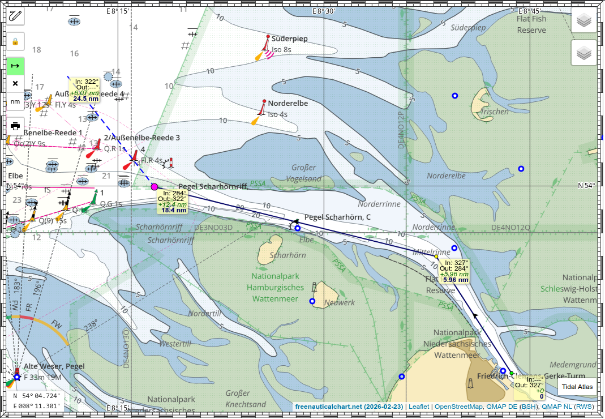
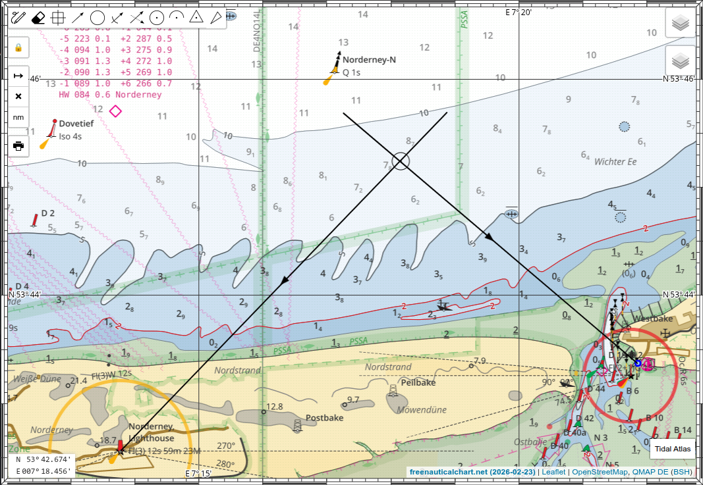
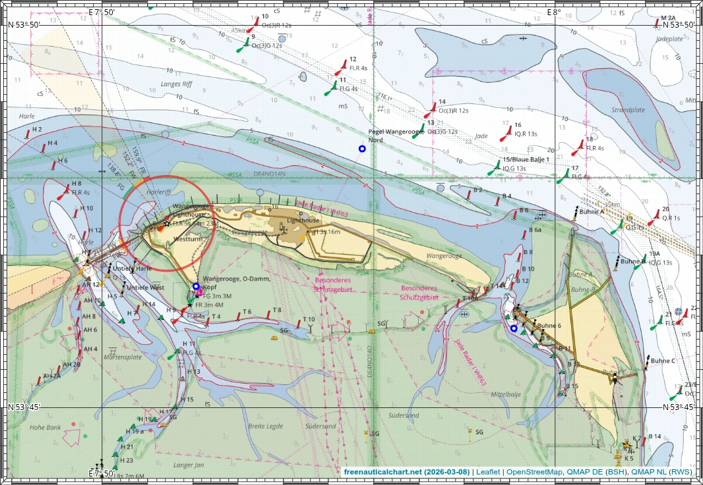

# Gebruik

Hoe gebruikt men de zeekaart?

## In de browser

Je kunt de kaart in de browser gebruiken zoals elke andere kaart, om de kaart weer te geven en tochten te plannen.
Naast de kaart zelf zijn er enkele extra functies die nuttig zijn voor de navigatie en hieronder worden toegelicht.

## App-modus

De zeekaart kan als [PWA](https://en.wikipedia.org/wiki/Progressive_web_app) worden geïnstalleerd.
Hiervoor kies je "Installeren" of "Aan startscherm toevoegen" in het menu van de browser.
Dit werkt het beste met op Chrome gebaseerde browsers.
De app-modus toont andere pictogrammen in de werkbalk dan de website-modus, zoals bijvoorbeeld de GPS-positie van het apparaat en de nachtmodus met donkere kleuren.

Daarnaast worden in de app-modus de kaarttegels en getijdenvoorspellingen die je hebt bekeken in een cache opgeslagen, zodat ze later offline beschikbaar zijn.
Verder werkt het net als de kaart in de browser; de app is uiteindelijk slechts een browser in PWA-modus.

## Afdrukken

Je kunt zeekaarten eenvoudig rechtstreeks vanuit de browser afdrukken. Hoe dat werkt, wordt [hier](print.md) beschreven.

## Getijden

Getijdenhoogten en -stromen kunnen worden weergegeven zoals [hier](tides.md) beschreven. Heel praktisch voor de tochtplanning om dit direct in de zeekaart beschikbaar te hebben.

## Routegereedschap

Het routegereedschap (groene knop op de afbeelding hierboven) maakt het mogelijk waypoints te plaatsen en koers en afstand tussen hen af te lezen.

## Nachtmodus

Voor gebruik in het donker is er een modus met donkere kleuren. Je schakelt de nachtmodus in met het maansymbool.
De helderheid wordt omgekeerd, maar de kleuren blijven gelijk.

## GPS-tracking

Je kunt ook de GPS van het apparaat gebruiken.
Wanneer je op het bootsymbool tikt, wordt de GPS-positie op de kaart weergegeven met een KüG-vector van 10 minuten lengte.
KüG en FüG worden in de linkerbenedenhoek weergegeven.

## Kaartgereedschappen

Dit is een bijzondere functie van deze kaart.
Ze combineert moderne elektronica en een digitale zeekaart met klassieke navigatiemethoden, zoals deze op een papieren kaart werden uitgevoerd. Dit maakt het mogelijk GPS- en klassieke terrestrische navigatie te combineren of terug te vallen op handmatige navigatie als het GPS uitvalt of wordt verstoord.
Dit soort halfautomatische navigatie maakt je mogelijk ook bewuster van wat je daadwerkelijk doet en waar je werkelijk bent.
Bij solozeilen of met een zeer kleine bemanning maken de kaartgereedschappen het mogelijk een scheepspositie rechtstreeks op de digitale zeekaart te plotten op basis van enkele peilingen met slechts een paar handelingen.
Je hoeft de peilingen niet op te schrijven, naar beneden te gaan, te rekenen en met driehoek en potlood in de weer te zijn, waarbij je mogelijk zeeziek wordt.
Dit kan dus de zorgvuldigheid, goed zeemanschap en de veiligheid verbeteren.
En tot slot is het een zeer goed hulpmiddel voor educatieve doeleinden. Je kunt het gebruiken om jezelf verder te scholen of om anderen les te geven en materiaal en oefeningen voor te bereiden.

De beschikbare gereedschappen zijn (van links naar rechts)

- **Pen** - werkbalk openen/sluiten
- **Gum** - alle tekeningen wissen
- **Waypoint** - een WP-marker plaatsen
- **Peiling** - peillijn tekenen, rechtwijzende en miswijzende waarde worden weergegeven
- **Afstand** - afstandscirkel tekenen
- **Peiling & Afstand** - peillijn tekenen en afstandsmarkering plaatsen (radarfix)
- **Verzeilde peiling** - peillijn tekenen en vervolgens parallel langs een koersvector verschuiven
- **Fix** - een scheepspositiemarker plaatsen
- **Koppelen** - koppellijn met richting en afstand tekenen
- **Stroomopgave 1** - stroomdriehoek, koppellijn tekenen en daarna stroomvector
- **Stroomopgave 2** - stroomdriehoek, stroomvector tekenen, vervolgens koers over de grond en daarna vaart door het water

### Elektronisch kompas

Veel smartphones en tablets beschikken over ingebouwde sensoren voor het magnetisch veld en versnelling. Deze kunnen via de Sensor‑API van de browser worden gebruikt, indien ondersteund. De [AbsoluteOrientationSensor](https://developer.mozilla.org/en-US/docs/Web/API/AbsoluteOrientationSensor) maakt het mogelijk het apparaat als een hellingsgecompenseerd magneetkompas te gebruiken. Je krijgt een nauwkeurige magnetische peiling, ook wanneer het apparaat niet horizontaal wordt gehouden. Door optelling van de misswijzing wordt de magnetische peiling automatisch omgerekend naar een rechtwijzende (ware) peiling.

Op die manier kan de smartphone zowel als kaartweergave als handpeilkompas dienen. Detecteert de app een werkende oriëntatiesensor, dan verschijnt een extra peilgereedschap met een blauwe achtergrond. Tik je op het symbool en plaats je een marker op de kaart op het gepeilde object, dan wordt de peilijn automatisch volgens de apparaatoriëntatie getekend. Tik vervolgens ergens op het scherm om de peiling vast te zetten.

Omdat je het apparaat niet horizontaal hoeft te houden, kun je het licht naar links of rechts kantelen en over één van de lange randen kijken om het op het object uit te richten. Je hoeft niet op het scherm te kijken; tik één keer wanneer het apparaat is uitgericht en rustig wordt gehouden.

!!! warning "Kompascalibratie"
    Voor nauwkeurige meetwaarden is het absoluut noodzakelijk om **voor het peilen een kompascalibratie uit te voeren**. Dit is meestal op te roepen in de standaard kaarten-app door op de positie-marker te tikken, of gebruik een app zoals [GPS Status](https://play.google.com/store/apps/details?id=com.eclipsim.gpsstatus2).

## Vergelijking van veranderingen

Een andere functie is het vergelijken van kaarten van verschillende tijdstippen. Rechtsboven kun je naast de huidige kaart een oudere versie van de kaart selecteren. Oude versies herken je aan de datumaanduiding en doordat het vlaggetje ontbreekt. Selecteer je bijvoorbeeld de huidige en een oude kaart, dan wordt de oude kaart over de nieuwere heen gelegd. Met de transparantieschuifregelaar kun je nu tussen beide kaarten heen- en weerblenden en verschillen direct zien. Een klik op de kaart terwijl je de Alt-toets ingedrukt houdt activeert het periodiek in- en uitfaden van de bovenste kaartlaag met een interval van enkele seconden. Zo kun je door de kaart navigeren en vallen veranderingen tussen de versies direct op.
