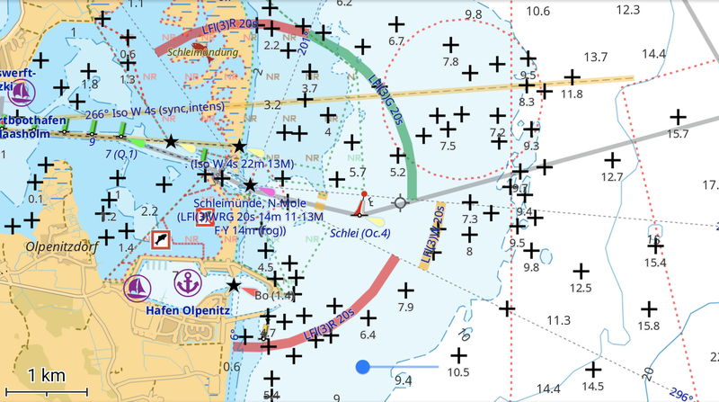
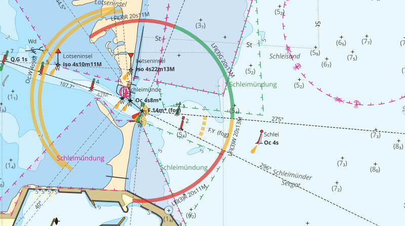

[<< Back to Chart](..)

# Chart Files

Here you find precompiled charts for download in various formats usable in different applications.

## [OsmAnd](https://osmand.net/)

### Vector Charts

Vector charts and styles for OsmAnd can be installed by simply opening the `obf` or `xml` file with the OsmAnd app, it will automatically import the file and use it as part of the "offline vector chart".

- [QMAP DE](qmap-de.obf)
- [Depth Contours DE](depth-de.obf)
- [Depth Data NL](depth-nl.obf)
- [Light Sectors Worldwide](lightsectors.obf)

To make full use of the data in these files in form of a [nautical chart](https://osmand.net/docs/user/plugins/nautical-charts/), you have to

- use [render engine 2 (OpenGL)](https://osmand.net/docs/user/personal/global-settings#map-rendering-engine),
- enable the [nautical charts plugin](https://osmand.net/docs/user/plugins/nautical-charts),
- use the [boating profile](https://osmand.net/docs/user/personal/profiles/),
- enable the display of [nautical depth](https://osmand.net/docs/user/plugins/nautical-charts#depth-contours),
- **install and activate** the following [rendering styles](https://osmand.net/docs/user/map/vector-maps).

When installing the rendering styles, choose "replace" when asked.

- [Marine Rendering Style](marine.render.xml)
- [Depth Data Rendering Style](depthcontourlines.addon.render.xml)

### Raster Charts

OsmAnd also allows the use of [raster charts](https://osmand.net/docs/user/map/raster-maps) via the [online maps plugin](https://osmand.net/docs/user/plugins/online-map/). The charts are imported by opening the `sqlitedb` files with the app. You can use them as [base map](https://osmand.net/docs/user/map/raster-maps/#main) or as an [overlay](https://osmand.net/docs/user/map/raster-maps#overlay-layer).

- [QMAP DE](qmap-de.sqlitedb)
- [QMAP NL](qmap-nl.sqlitedb)

The raster charts can also be added for [online usage](https://osmand.net/docs/user/plugins/online-map/), open the following [links](https://osmand.net/docs/user/map/raster-maps#magic-url-to-install-map-source) in OsmAnd to add them as map sources (`sqlitedb` format recommended) or [add them manually](https://osmand.net/docs/user/map/raster-maps#add-new-online-raster-map-source). This is useful for [downloading](https://osmand.net/docs/user/map/raster-maps/#download--update-tiles) only parts of the charts for offline usage.

- QMAP DE online [`http://waddenzee.duckdns.org/qmap-de/{0}/{1}/{2}.png`](http://osmand.net/add-tile-source?name=Waddenzee&min_zoom=8&max_zoom=16&url_template=http://waddenzee.duckdns.org/qmap-de/%7B0%7D/%7B1%7D/%7B2%7D.png)
- QMAP NL online [`http://waddenzee.duckdns.org/qmap-nl/{0}/{1}/{2}.png`](http://osmand.net/add-tile-source?name=Waddenzee&min_zoom=8&max_zoom=16&url_template=http://waddenzee.duckdns.org/qmap-nl/%7B0%7D/%7B1%7D/%7B2%7D.png)

## [JOSM](https://josm.openstreetmap.de/)

The raster charts can be added to JOSM as [imagery layers](https://josm.openstreetmap.de/wiki/Help/Preferences/Imagery).

- QMAP DE `tms:http://waddenzee.duckdns.org/qmap-de/{zoom}/{x}/{y}.png`
- QMAP NL `tms:http://waddenzee.duckdns.org/qmap-nl/{zoom}/{x}/{y}.png`

## [AvNav](https://www.wellenvogel.net/software/avnav/docs/beschreibung.html)

AvNav uses raster charts in form of [GEMF](https://www.wellenvogel.net/software/avnav/docs/charts.html#chartformats) files. Simply drop the files into AvNav's `charts` folder.

- [QMAP Germany](qmap-de.gemf)
- [QMAP Netherlands](qmap-nl.gemf)

## [OpenCPN](https://opencpn.org/)

OpenCPN and other applications can display raster charts from `mbtiles`.

- [QMAP Germany](qmap-de.mbtiles)
- [QMAP Netherlands](qmap-nl.mbtiles)

----

[>> This project on GitHub](https://github.com/quantenschaum/mapping)